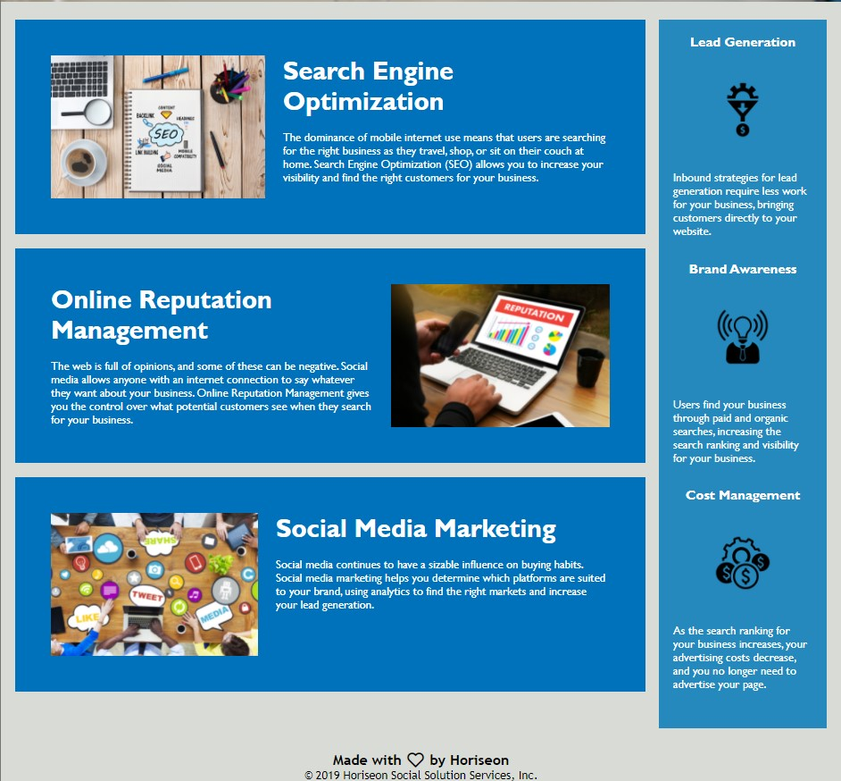

# Horiseon

[Horiseon webpage](https://luise115.github.io/Horiseon/)

## Description

Fully optimized codebase and accessibility features of Horiseon's website.

The new version of the webpage count with semantic elements following accessibility standards for better optimization for search engines. An organized and identified structure of elements for better maintenance, update and easy access. Also have significative comments in order to describe each section of the codebase.

## CHANGELOG:

- [X] Convert non-semantic elements into semantic elements.
- [X] Proper implementation of accessibility features.
- [X] Add a striking title.
- [X] Optimize css.
- [X] Correct cascading style.
- [X] Identification of relevant elements.
- [X] Comments to describe important elements and functions.

## Page preview

